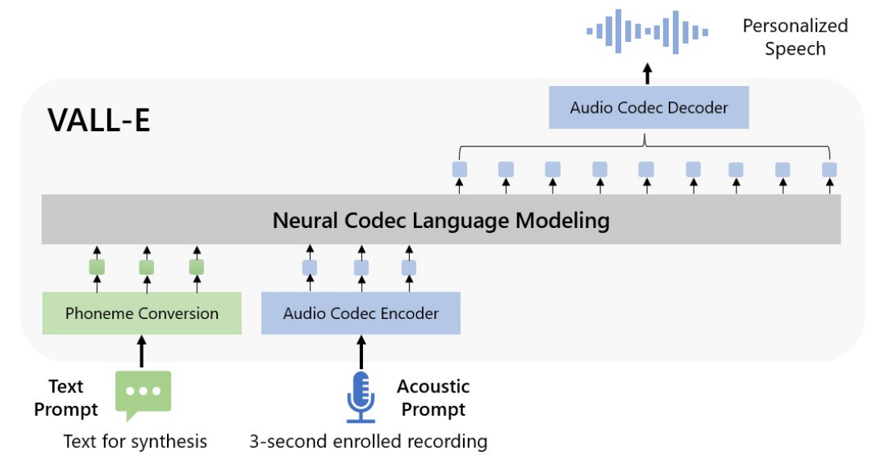
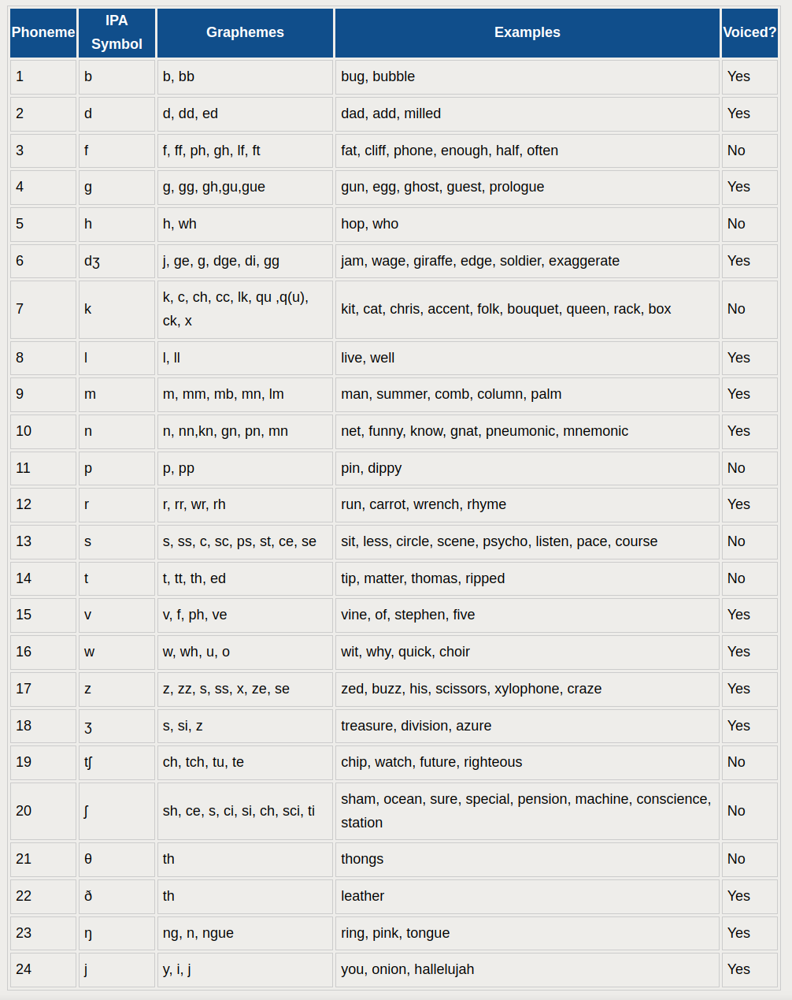
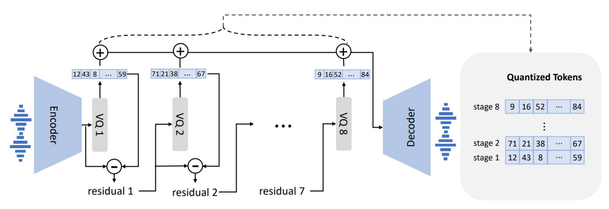

# VALL-E
CS 674 Project 1: My plan is to replicate the work done to create VALL-E


Paper link: https://arxiv.org/pdf/2301.02111.pdf

Could be worth looking at this link down the road: https://github.com/enhuiz/vall-e

|Day|<div style="width:230px">Hours</div>|Accomplished
|---|------|---|
|2/14|7:00PM - 8:15PM = 1.25hrs |Read paper, wrote notes and README
|2/14|9:00PM - 10:15PM = 1.25hrs |Wrote script to download datasets
|2/14|10:15PM - 1:00AM = 2.75hrs |Learned about DNN-HMM models, and began writing one for phoneme conversion
|2/15|8:30PM - 10:30PM = 2.00hrs |To break the problem down further, I learned more about HMM models and began writing one by scratch. I was able to train it, now I just need to set it up for ASR.
|2/16|11:30AM - 2:30PM = 3.00hrs |Read more about DNN-HMM models (I learned that they are called 'hybrid' or 'chain' models) implemented using the <a href="https://kaldi-asr.org/doc/chain.html#:~:text=The%20%27chain%27%20models%20are%20a%20type%20of%20DNN-HMM,design%20point%20in%20the%20space%20of%20acoustic%20models.">Kaldi</a> toolkit. Because I wanted to fully understand the implementation of DNN-HMM models, I continued working on the model I started 2/14. I was able to find an existing codebase that I could gain intuition from. I wanted to start with something simpler, so I used it for spoken digit recognition. I needed to modify the existing codebase to work with a free dataset I found online.
|2/16|5:45PM - 9:15PM = 3.50hrs |Finish DNN-HMM code for digit recognition. Training completed, but performance was terrible. Working on sizing the model up, converting to tensors instead of np arrays so that the model can be trained faster and larger on GPU. Model is training, but not increase of performance.
|2/17|8:30AM - 2:00PM = 5.50hrs |Read more about MFCCs, and formed hypothesis that using them will drastically increase my performance. Also read more about GMM (Gaussian Mixture Models), so that I could better understand what they were doing, and how they can be used in a GMM-HMM method to predict phonemes. Discovered that a HMM with 3 states is the best size. Implemented MFCCs, and performance doubled, but broke the final portion of the code. Working on fixing that. To better understand my model, and in an attempt to fix the lacking performance and issues, I decided to take a deep dive into GMM models. I discovered the EM-Algorithm, which I chose to learn more about, because I wanted to verify the functions declared in the code (because I was getting some zero division, which I believe was impacting the performance of my model).
|2/17|4:00PM - 6:00PM = 2.00hrs |Read more about GMMs, and verified that the algorithms used were correct, and plotted the distributions of each GMM for the individual digit recognition. Also discovered that the clipping/padding length I had is what was causing my division by 0. Mean centered my cutoff more, and performance increase, and division by 0 disappeared.
|2/18|2:30PM - 7:45PM = 5.25hrs | Worked on the log likelihood function. Figured out that the way I was padding my data was causing me division by 0, because the difference of two sequences were being checked, and because they were padded the same, they truly were identical sequences, so the variation would be 0. To accomodate for this, I decided to alter my normalized length more in the center of the distribution of my data. Additionally, I discovered that the accuracy calculation was wrong at the end, so I calculated by hand. IT WORKS! I also worked on writing the paper.
|**Total**|**26.50**|

Architecture:


## Phoneme Conversion
"Hybrid DNN-HMM ASR model on 960 hours labeled LibriSpeech following Kaldi recipe. Once trained, unlabeled speech data is decoded and transduced to best phoneme-level alightment paths where frameshift is 30ms"


This is a link to a DNN-HMM ASR paper: https://ieeexplore.ieee.org/abstract/document/6681449
Based upon my research, these are also referred to as "Chain" models
Another helpful link: https://github.com/raminnakhli/HMM-DNN-Speech-Recognition
Help HMM link: https://www.inf.ed.ac.uk/teaching/courses/asr/2020-21/asr04-hmmgmm.pdf

### Entire list of all 44 phonemes in the English Language



## Audio Codec Encoder
Link: https://arxiv.org/pdf/2209.03143.pdf


## Neural Codec Language Modeling
Transformer architecture with 12 layers, 16 attention heads, embedding dimension of 1024, a feed-forward layer dimension of 4096, and a dropout of 0.1. Average length of waveform in LibriLight is 60 seconds. During training, randomly crop the waveform to a random length between 10 seconds and 20 seconds. It's corresponding phoneme alignments are used as the phoneme prompt. 

AdamW optimizer.


### Encodec
They use a pre-trained one, "EnCodec" 

"EnCodec is a convolutional encoder-decoder model, whose input and output are both 24kHz audio across variable bitrates."

EnCodec Links: 
    - https://arxiv.org/pdf/2210.13438.pdf
    - https://pypi.org/project/encodec/
    - https://github.com/facebookresearch/encodec

## Audio Codec Decoder

## Datasets
LibriLight, 60K hours of English speech, with over 7000 unique speakers. Original data is audio-only, so ASR is used to generate transcriptions.

Link: https://github.com/facebookresearch/libri-light/blob/main/data_preparation/README.md

    LibriSpeech 
Link: http://www.openslr.org/12

<br>

## Random helpful links
- http://cs229.stanford.edu/section/cs229-hmm.pdf

From late night:
- https://stackoverflow.com/questions/42339786/how-to-plot-the-pdf-of-a-1d-gaussian-mixture-model-with-matplotlib
- https://towardsdatascience.com/gaussian-mixture-model-clearly-explained-115010f7d4cf
- https://github.com/indigos33k3r/easy_gmmhmm
- https://github.com/wblgers/hmm_speech_recognition_demo
- https://gist.github.com/kastnerkyle/75483d51641a0c03bf7c
- https://github.com/desh2608/gmm-hmm-asr
- https://www.quora.com/How-does-GMM-HMM-model-work-in-ASR

## Notice

- [EnCodec](https://github.com/facebookresearch/encodec) is licensed under CC-BY-NC 4.0. If you use the code to generate audio quantization or perform decoding, it is important to adhere to the terms of their license.


## Citations
```bibtex
@article{wang2023neural,
  title={Neural Codec Language Models are Zero-Shot Text to Speech Synthesizers},
  author={Wang, Chengyi and Chen, Sanyuan and Wu, Yu and Zhang, Ziqiang and Zhou, Long and Liu, Shujie and Chen, Zhuo and Liu, Yanqing and Wang, Huaming and Li, Jinyu and others},
  journal={arXiv preprint arXiv:2301.02111},
  year={2023}
}
```
```bibtex
@article{defossez2022highfi,
  title={High Fidelity Neural Audio Compression},
  author={Défossez, Alexandre and Copet, Jade and Synnaeve, Gabriel and Adi, Yossi},
  journal={arXiv preprint arXiv:2210.13438},
  year={2022}
}
```

## TODO

- [x] Write a script to download the datasets
- [x] Figure out DNN-HMM ASR model for transcribing
- [ ] Convert DNN-HMM to phoneme level
- [x] install and setup EnCodec
- [ ] Build Transformer Decoder
- [ ] Setup NAR and AR configurations for Decoder